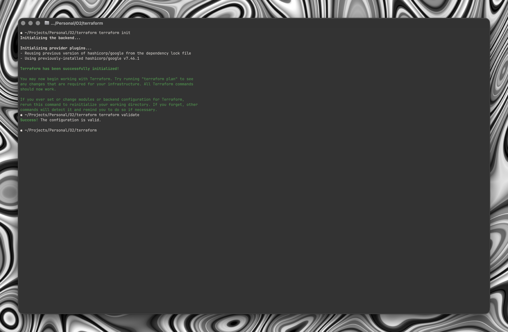
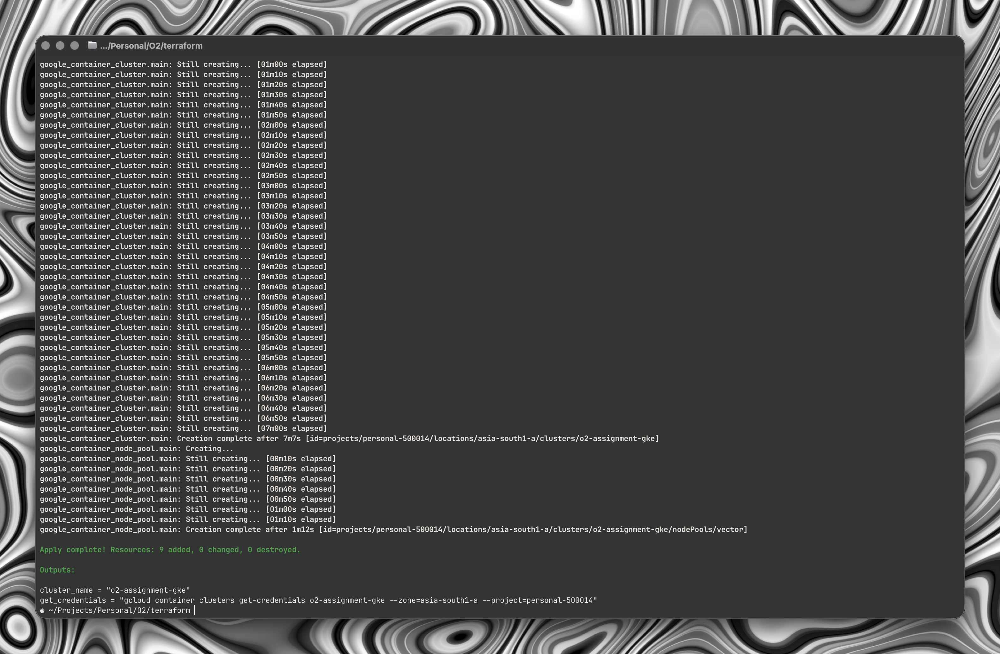
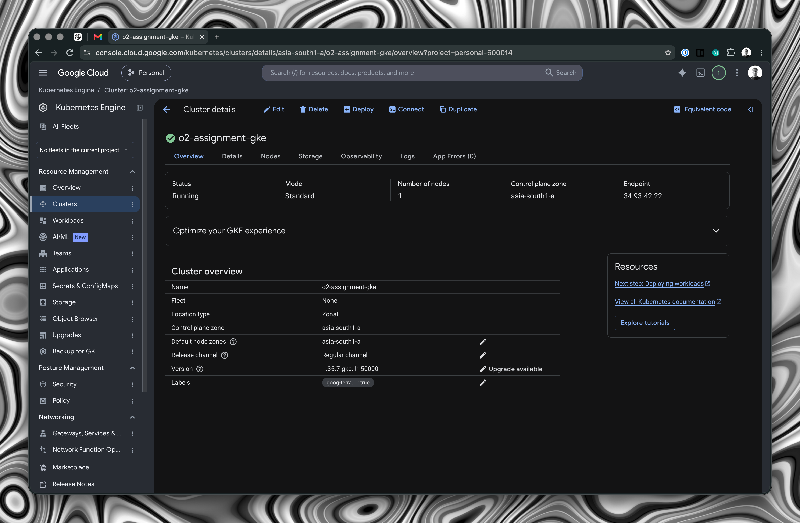
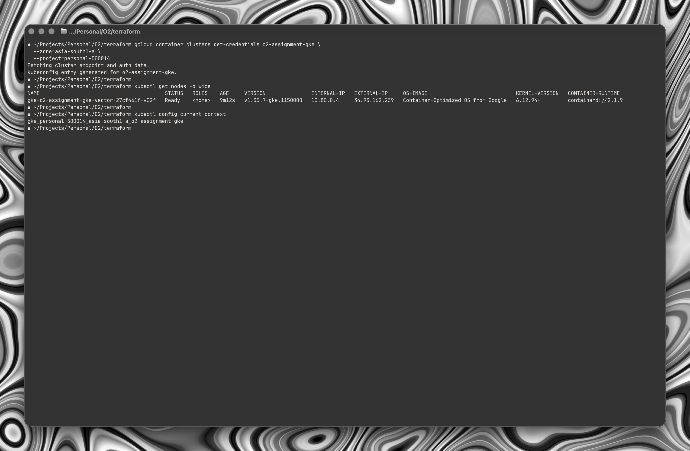
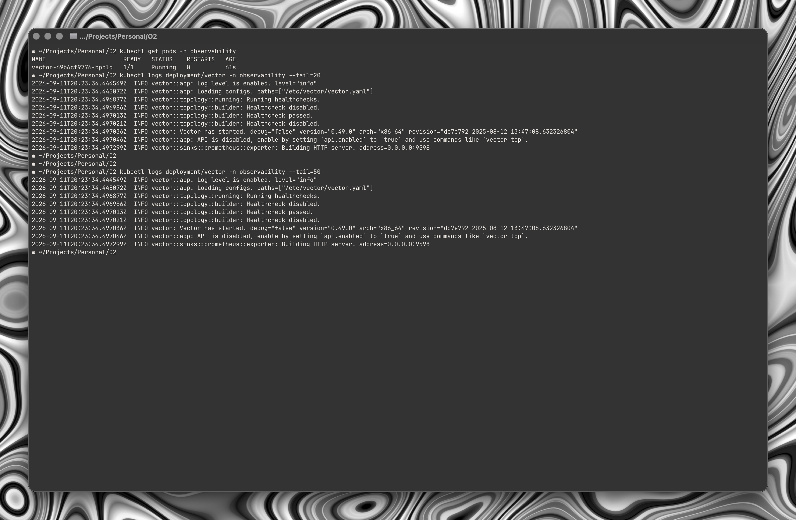
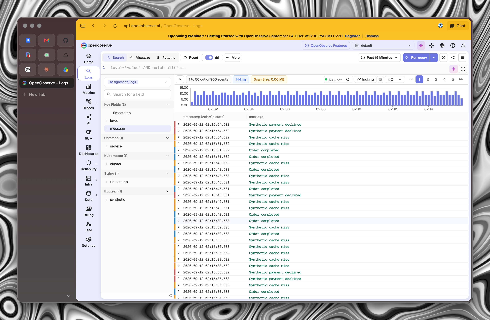
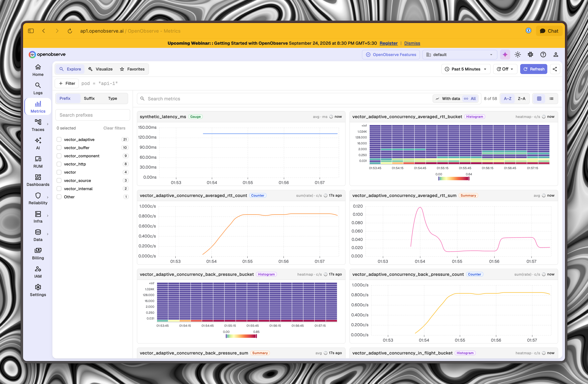
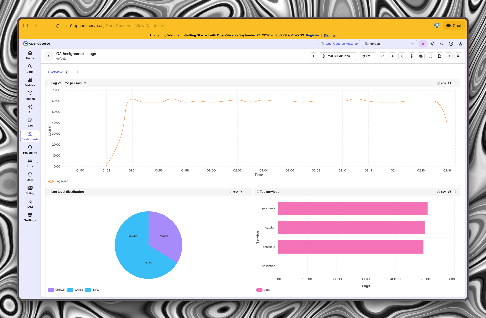
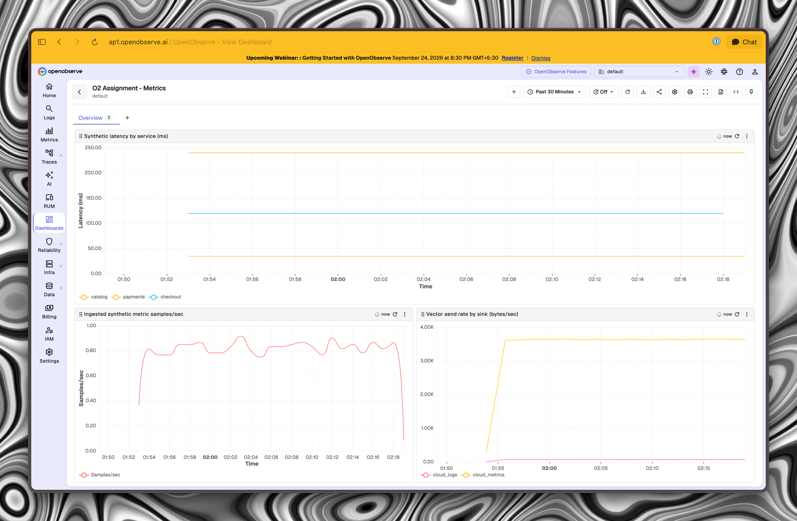

# Screenshots

Screenshots from the initial deployment and low-rate validation.

These dashboard screenshots show the earlier three-panel versions, before the load-test rate panels were added. They demonstrate working ingestion and rendering, not the final throughput result. See [throughput validation](../throughput.md) for the measured run and byte-size definition.

## Terraform init and validation

## Terraform apply complete

## Gke cluster overview

## Kubectl node ready

## Vector pod and clean startup

## Openobserve logs low rate

## Openobserve metrics low rate

## Logs dashboard low rate

## Metrics dashboard low rate

